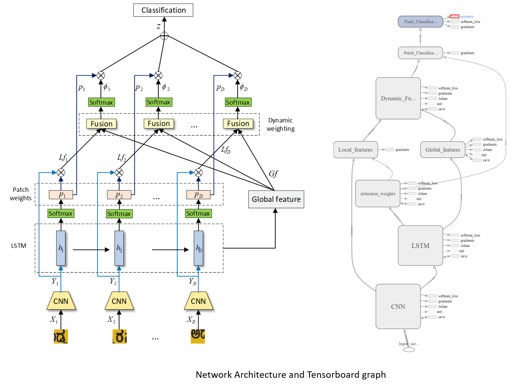
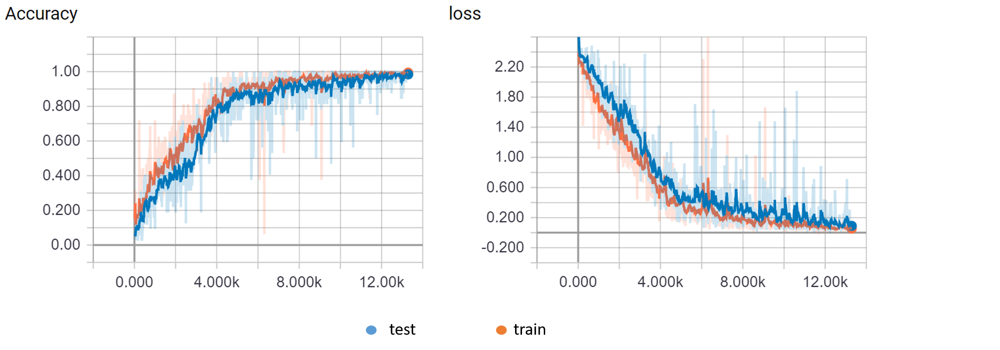
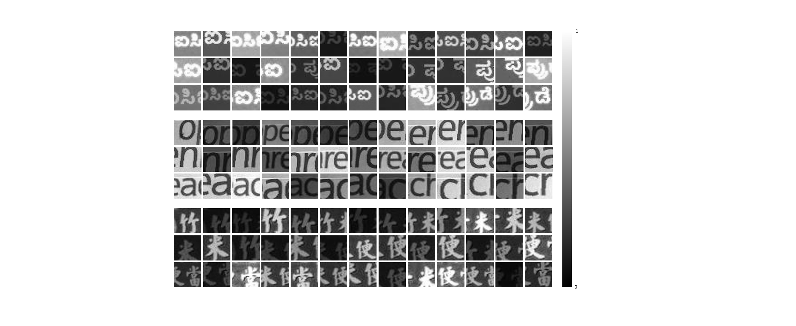

# Script Identification in Natural Scene Image and Video Frame using Attention based Convolutional-LSTM Network [[Arxiv]](https://arxiv.org/ftp/arxiv/papers/1801/1801.00470.pdf)
<font color="red">Status: **Not yet implemented**</font>
This repository contains the codes and instructions to use the trained models for all the four datasets described in the paper. 


## Introduction

Script identification plays a significant role in analysing documents and videos. In this paper, we
focus on the problem of script identification in scene text images and video scripts. Because of
low image quality, complex background and similar layout of characters shared by some scripts
like Greek, Latin, etc., text recognition in those cases become challenging.

## Pre-requisites

- python 2.7
- Tensorflow 
- OpenCV
- matplotlib
- jupyter notebook

## Training
- ####  Network Architecture
 In this paper, we propose a novel
method that involves extraction of local and global features using CNN-LSTM framework and
weighting them dynamically for script identification. First, we convert the images into patches
and feed them into a CNN-LSTM framework. Attention-based patch weights are calculated
applying softmax layer after LSTM. Then we do patch-wise multiplication of these weights with
corresponding CNN to yield local features. Global features are also extracted from last cell state
of LSTM. We employ a fusion technique which dynamically weights the local and global
features for an individual patch



You can also interactively visualize the tensorboard graph by running the following:

```
tensorboard --logdir='logfiles'
```

- #### Training curves

Tensorboard scaler plot of loss function and accuracy over number of epochs on CVSI-15 dataset



- #### Visualize Attention maps



We can visualize the relative importance of the patches from the attention maps. High attention is shown in white and low attention is shown in black. 

## Datasets & Trained models
We evaluated our model on four datasets : [CVSI-2015](http://www.ict.griffith.edu.au/cvsi2015/Dataset.php),  [SIW-13](http://mclab.eic.hust.edu.cn/~xbai/mspnProjectPage/),  [ICDAR-2017](http://rrc.cvc.uab.es/?ch=8&com=downloads),  [MLe2e](https://www.researchgate.net/profile/Lluis_Gomez2/publication/297469752_MLe2e_multi-lingual_end-to-end_dataset/data/56df2dea08ae9b93f79a8f42/MLe2e-Dataset-v02.zip). To faciliate further research, we are making available the trained models on all these four datasets.  

| Dataset    | Trained Model |  Accuracy |
|----------  |-------------|-------------|
| CVSI-15   |  [Download](https://drive.google.com/open?id=1_Z-XV1Pi-UmIgnjJjVvpCkMiRKqFBmrR) |   97.75% |
|    SIW-13  |     [Download](https://drive.google.com/open?id=1vK_CjS-I9_pNK2Cm_JCgp06gKcL6lOrB) |  96.5%   |
| ICDAR-17   |  [Download]() |  90.23%  |
|    MLe2e |     [Download](https://drive.google.com/open?id=1miaoG0AGlWLltvklU0V870wR0q09CBdo) |   96.7%   |


## Usage
Clone or download this repository. Download the pre-trained models and unzip the models in the `Models/<dataset_name>` folder. Now, open `jupyter notebook` , run the [main.ipynb](main.ipynb) file and execute the code. 

## Authors

- [Ankan Kumar Bhunia*](https://scholar.google.com/citations?user=2leAc3AAAAAJ&hl=en)
- [Aishik Konwer*](https://scholar.google.co.in/citations?user=Vtq1xfgAAAAJ&hl=en)
- Abir Bhowmick
- [Ayan Kumar Bhunia](https://sites.google.com/site/ayanbhunia007/)

\* Both the authors contributed equally. 


